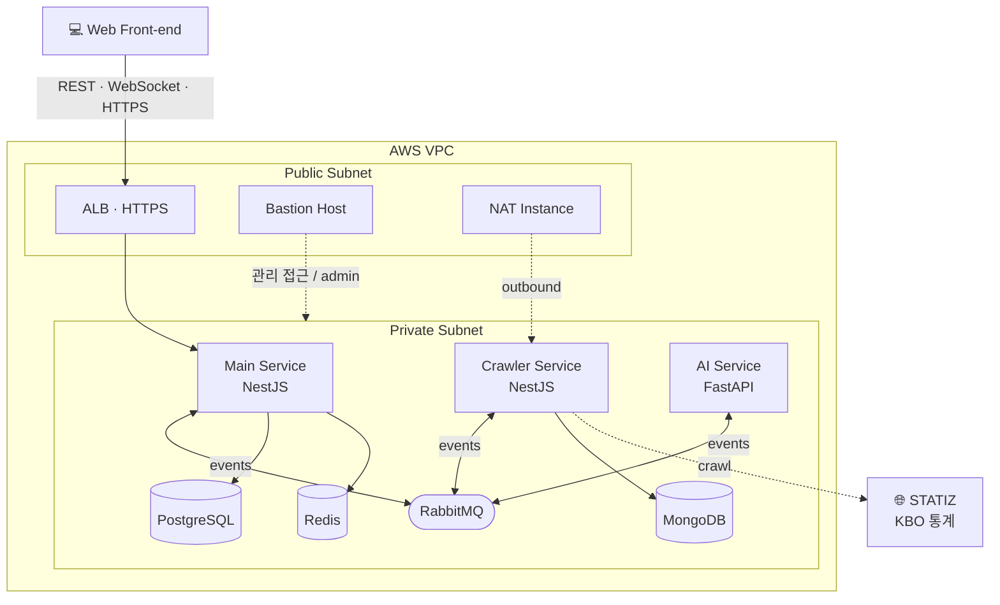
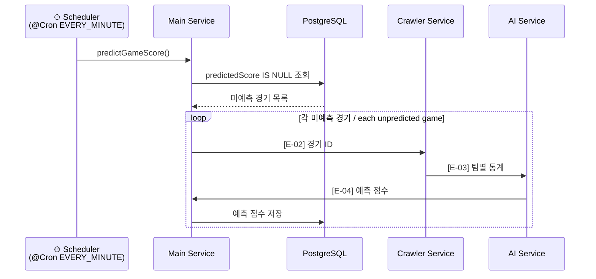
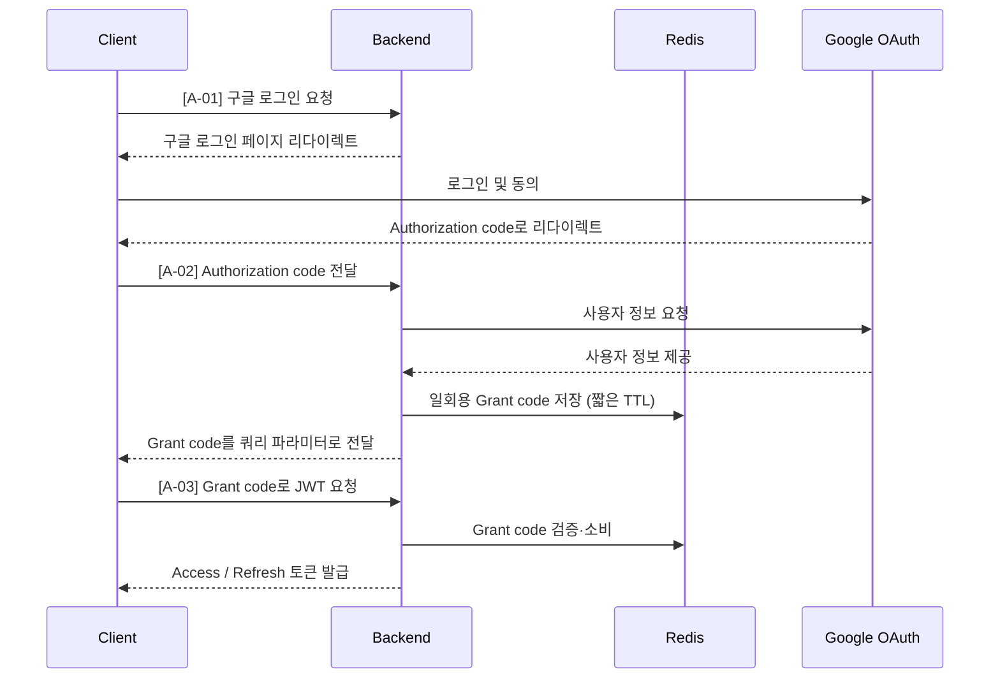
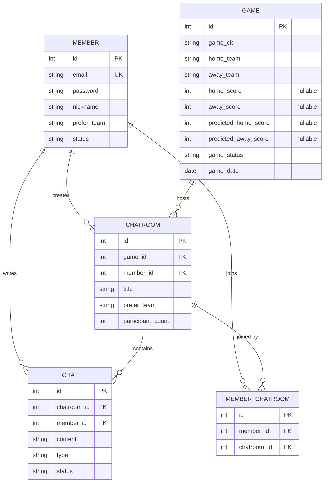
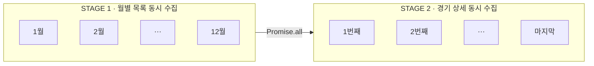
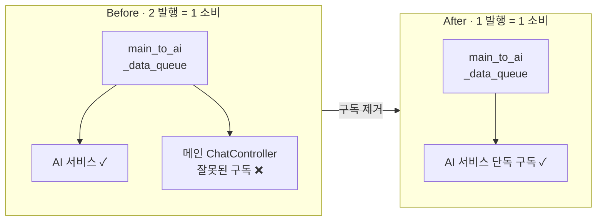

<div align="center">

# Basetalk

**KBO 팬을 위한 승부예측·채팅 서비스 · 이벤트 기반 MSA 백엔드**

**A win-prediction & live-chat service for KBO fans — an event-driven microservice backend**

<br/>


`2024.09 ~ 2024.12` · `Team of 4 (BE 1 · FE 1 · AI 2)` · `PM · Back-end` · `서강대학교 산업수학(캡스톤디자인) 프로젝트 / Sogang University Capstone Project`

</div>

---

## 📌 개요 / Overview

**KO** — `Basetalk`은 KBO 경기의 **승부 예측**과 팬 간 **실시간 채팅**을 결합한 서비스입니다. 크롤링한 KBO 통계를 AI 모델에 입력해 경기 점수를 예측하고, 경기별 채팅방에서 비속어 필터링이 적용된 실시간 대화를 제공합니다. 백엔드는 채팅·크롤링·AI 워크로드의 특성이 서로 달라, 이를 **이벤트 기반 마이크로서비스(MSA)** 로 분리하고 `RabbitMQ`로 통신하도록 설계했습니다. 팀장으로서 전체 일정·역할 조율과 함께 메인 서비스 백엔드를 단독으로 개발하고, 운영 중 발생한 성능·정합성·메시징 문제를 추적·해결하는 데 집중했습니다.

**EN** — `Basetalk` combines **win prediction** for KBO games with **real-time chat** among fans. It feeds crawled KBO statistics into AI models to predict game scores, and provides profanity-filtered live chat in per-game chatrooms. Because the chat, crawling, and AI workloads have very different characteristics, the backend was designed as an **event-driven microservice architecture (MSA)** communicating over `RabbitMQ`. As the team lead, I coordinated scheduling and roles, single-handedly built the main backend service, and focused on tracking down and resolving the performance, consistency, and messaging issues that surfaced in operation.

---

## 👤 담당 역할 / My Role

> **PM · Back-end** — 팀 리딩과 메인 서비스 백엔드 단독 개발
> **PM · Back-end** — Team leadership and sole development of the main backend service

- **프로젝트 관리 / Project management** — 일정·역할 조율, UML 기반 인터페이스 문서로 FE·AI 연동 비용 절감
- **REST API 설계·구현 / REST API** — 인증·회원·경기·채팅방·채팅 도메인의 엔드포인트 설계 및 구현
- **인증 / Auth** — Google OAuth2 + 일회용 Grant code(Redis TTL) 기반 JWT 발급, 로컬 로그인/리프레시
- **실시간 채팅 / Real-time chat** — WebSocket(Socket.IO) + Redis 어댑터로 멀티 인스턴스 확장
- **이벤트 기반 통신 / Event-driven messaging** — RabbitMQ로 메인·크롤러·AI 서비스 간 이벤트 체인 설계
- **인프라 / Infrastructure** — AWS VPC·ALB·Bastion·HTTPS, Docker, GitHub Actions CI/CD

---

## 🛠 기술 스택 / Tech Stack

| 구분 / Category | 사용 기술 / Technologies |
| :--- | :--- |
| **Main Service** | NestJS (TypeScript) |
| **Crawler Service** | NestJS (TypeScript) · `cheerio` · `axios` |
| **AI Service** *(team)* | FastAPI (Python) |
| **Relational DB** | PostgreSQL (TypeORM · `typeorm-transactional`) |
| **NoSQL DB** | MongoDB (Mongoose) |
| **Cache / Session** | Redis (`ioredis` · `@socket.io/redis-adapter`) |
| **Message Broker** | RabbitMQ |
| **Real-time** | WebSocket (Socket.IO) |
| **Auth** | Google OAuth2 · JWT (access / refresh) |
| **Infra / CI·CD** | AWS (VPC · ALB · EC2) · Docker · GitHub Actions |
| **Testing** | Artillery (WebSocket load test) |

---

## ✨ 주요 기능 / Key Features

- **승부 예측 / Win prediction** — 크롤링한 팀별 타격·투구 통계를 AI 모델에 입력해 경기 점수를 예측
  Predicts game scores by feeding crawled per-team batting/pitching stats into AI models.
- **실시간 채팅 / Real-time chat** — 경기별 채팅방에서 WebSocket 기반 실시간 대화 (정원 20명)
  WebSocket-based live chat in per-game chatrooms (capacity 20 per room).
- **비속어 필터링 / Profanity filtering** — 채팅 전송 시 AI 서비스가 비속어를 판별하여 메시지 상태를 갱신
  The AI service classifies profanity on send and updates the message status accordingly.
- **KBO 데이터 수집 / KBO data collection** — STATIZ에서 연간 경기·통계를 주기적으로 수집·집계
  Periodically crawls and aggregates annual games and statistics from STATIZ.
- **소셜 로그인 / Social login** — Google OAuth2 로그인과 로컬 로그인을 모두 지원
  Supports both Google OAuth2 and local login.

---

## 🏗 시스템 아키텍처 / System Architecture

**KO** — 워크로드 특성에 따라 서비스를 분리했습니다. 채팅·크롤링은 I/O 중심이라 `NestJS`로, AI 추론(RNN/BERT)은 **CPU-Bounded** 작업이라 `FastAPI`로 인스턴스를 분리하여, AI 부하가 채팅 응답성에 전파되지 않도록 차단했습니다. 모든 서비스 인스턴스는 **Private Subnet**에 격리하고, 외부 트래픽은 메인 서비스 앞단의 **ALB(HTTPS)** 만 통과하도록 했으며, 관리 접근은 **Bastion Host**, 아웃바운드는 **NAT Instance**로 한정했습니다.

**EN** — Services were split by workload. Chat and crawling are I/O-bound (`NestJS`), while AI inference (RNN/BERT) is **CPU-bound** (`FastAPI`), so instances were separated to keep AI load from propagating into chat responsiveness. All service instances sit in a **private subnet**; external traffic enters only through an **ALB (HTTPS)** in front of the main service, admin access is limited to a **Bastion Host**, and outbound traffic goes through a **NAT Instance**.



---

## 🔗 마이크로서비스 이벤트 / Microservice Events

**KO** — 메인·크롤러·AI 서비스는 `RabbitMQ`를 매개로 이벤트 기반으로 통신합니다. 대표적으로 **점수 예측 파이프라인**은 `[메인 → 크롤러 → AI → 메인]`의 3단계 이벤트 체인으로 동작하며, 메인 서비스의 스케줄러가 미예측 경기를 1분 주기로 polling하여 체인을 시작합니다.

**EN** — The main, crawler, and AI services communicate via events through `RabbitMQ`. The **score-prediction pipeline** runs as a 3-stage event chain `[Main → Crawler → AI → Main]`, kicked off by a scheduler in the main service that polls unpredicted games every minute.

| ID | Event | Source → Destination | 설명 / Description |
| :--: | :--- | :--- | :--- |
| E-01 | `Game.Updated` | Crawler → Main | 갱신된 경기 정보 알림 / Notify updated game info |
| E-02 | `Game.Aggregate.Statistics` | Main → Crawler | 팀별 최근 통계 요청 / Request recent team stats |
| E-03 | `Game.Predict.Score` | Crawler → AI | 통계 기반 점수 예측 요청 / Request stat-based prediction |
| E-04 | `Game.Save.Prediction` | AI → Main | 예측 점수 저장 요청 / Request to persist prediction |
| E-05 | `Chat.Predict.Profanity` | Main → AI | 비속어 필터링 요청 / Request profanity filtering |
| E-06 | `Chat.Save.Prediction` | AI → Main | 필터링 결과 저장 요청 / Request to persist result |



---

## 🔐 인증 흐름 / Authentication Flow

**KO** — OAuth2 인증 완료 후 JWT를 리다이렉션 URL로 직접 전달하면 토큰이 URL에 노출될 위험이 있습니다. 이를 막기 위해 **일회용 Grant code**를 발급해 Redis에 **짧은 TTL**로 저장하고, 클라이언트가 이 code를 제시할 때만 JWT를 발급하도록 `[인증 → JWT 발급]` 단계를 분리했습니다. URL 노출 범위를 일회용 code로 한정해 보안성을 확보하고, Redis를 공유 저장소로 사용해 멀티 인스턴스 간 인증 상태를 공유할 수 있게 했습니다.

**EN** — Passing a JWT directly via the OAuth2 redirect URL risks exposing the token in the URL. To prevent this, a **one-time grant code** is issued and stored in Redis with a **short TTL**, and the JWT is issued only when the client presents that code — separating `[authentication → JWT issuance]`. This limits URL exposure to a single-use code and, since Redis is shared, lets auth state be shared across multiple instances.



---

## 🗄 데이터 모델 / Data Model

**KO** — 메인 서비스는 `PostgreSQL`로 회원·경기·채팅방·채팅을 관리합니다. 사용자–채팅방의 **다대다 관계**는 `MEMBER_CHATROOM` 매핑 엔티티로 표현했습니다. 경기의 예측 점수 컬럼(`predicted_*_score`)을 **nullable**로 설계해, `NULL`을 '미예측' 상태로 해석하여 별도 상태 컬럼 없이 polling 조건으로 활용했습니다. 크롤러 서비스는 `MongoDB`로 경기 상세 통계(`Games`·`BatStats`·`PitchStats`)를 별도 관리합니다.

**EN** — The main service manages members, games, chatrooms, and chats in `PostgreSQL`. The **many-to-many** user–chatroom relation is modeled via the `MEMBER_CHATROOM` mapping entity. The game's prediction columns (`predicted_*_score`) are intentionally **nullable**, so `NULL` is interpreted as an "unpredicted" state and reused as a polling condition without a separate status column. The crawler service keeps detailed game statistics (`Games`·`BatStats`·`PitchStats`) separately in `MongoDB`.



---

## 🔌 API 개요 / API Overview

> 모든 인증 필요 엔드포인트는 JWT 검증을 거치며, 발생 가능한 예외 응답을 Swagger로 명세했습니다.
> All authenticated endpoints pass JWT verification, and possible exception responses are documented via Swagger.

| Domain | 대표 엔드포인트 / Representative Endpoints |
| :--- | :--- |
| **Auth** | `GET /v1/auth/login/oauth2/google` · `POST /v1/auth/login/oauth2/grant-code` · `POST /v1/auth/login/local` · `POST /v1/auth/sign-up/local` · `POST /v1/auth/jwt/refresh` · `POST /v1/auth/logout` |
| **Members** | `DELETE /v1/members` |
| **Games** | `GET /v1/games?year=&month=&day=` |
| **Chatrooms** | `POST /v1/chatrooms` · `POST /v1/chatrooms/:id/enter` · `POST /v1/chatrooms/:id/leave` · `PATCH /v1/chatrooms/:id` · `DELETE /v1/chatrooms/:id` · `GET /v1/chatrooms` |
| **Chats** | `GET /v1/chats?chatroomId=&chatId=&loadCount=` (pagination) |
| **WebSocket** | `joinRoom` · `leaveRoom` · `chat` (namespace `/chat`) |

> 전체 명세는 [REST API 문서](./docs/Rest-API.md) · [WebSocket 가이드](./docs/WebSocket-guide.md)를 참고하세요.
> See the full [REST API doc](./docs/Rest-API.md) and [WebSocket guide](./docs/WebSocket-guide.md).

---

## 🚀 주요 문제 해결 / Key Problem-Solving

### 1. 크롤링 파이프라인 동시 처리 — 60s → 6s (10×) / Concurrent crawling pipeline

**KO** — 연간 경기 데이터 720건을 `월별 경기 목록 → 경기별 상세` 순서로 순차 수집하여 HTTP 요청 732건에 **약 60초**가 소요됐습니다. 선행 의존성을 분석한 결과, 같은 단계 내 작업들은 서로 독립적임을 확인하고 `Promise.all` 기반 **2단계 동시 수집 파이프라인**으로 재구성했습니다 (STAGE 1: 1~12월 목록 동시 수집 → STAGE 2: 전체 경기 상세 동시 수집). 대기 시간(W)이 실행 시간(R)보다 지배적인 I/O 작업 특성상 개선 효과가 작업 수(N)배로 수렴하여 **약 6초로 10배 이상 단축**했습니다.

**EN** — Collecting 720 annual games as `monthly list → per-game detail` sequentially took **~60s** across 732 HTTP requests. After a dependency analysis showed tasks within a stage are mutually independent, I restructured it into a **2-stage concurrent pipeline** using `Promise.all` (STAGE 1: fetch all 12 monthly lists concurrently → STAGE 2: fetch all game details concurrently). For I/O work where wait time (W) dominates run time (R), the speedup converges toward N×, cutting the time to **~6s (10×+ faster)**.



> **반성 / Reflection** — STAGE 2 진입 전 STAGE 1 전체 완료를 기다리는 의존성이 남아 있습니다. 파이프라인을 중첩(overlap)하여 월별 목록 수집 완료 즉시 상세 수집을 시작하면 추가 개선이 가능합니다.

### 2. 이벤트 체인 정합성 — DB 기반 Polling 재시도 / Event-chain consistency via DB polling

**KO** — 점수 예측은 `[메인 → 크롤러 → AI → 메인]`의 3단계 이벤트 체인이라, 어느 한 서비스에서 장애가 발생하면 예측 결과가 DB에 저장되지 못합니다. 브로커 기반 실패 감지(RabbitMQ DLQ)는 **브로커 자체 장애 시 감지 불가**하고 브로커에 다시 의존하는 순환 구조가 되어 기각했습니다. 대신 **DB를 Source of Truth**로 삼아, `predicted_score IS NULL`인 경기를 1분 주기로 조회·재발행하는 polling 재시도 메커니즘을 구축했습니다. 크롤러·AI 서비스에 의도적으로 장애를 주입한 환경에서 서비스 재기동 후 정상 복구를 검증했습니다.

**EN** — Score prediction is a 3-stage event chain `[Main → Crawler → AI → Main]`, so a failure in any service prevents the result from being persisted. Broker-based failure detection (RabbitMQ DLQ) was rejected because it **cannot detect broker failures** and re-depends on the broker (a circular structure). Instead, treating the **DB as the source of truth**, I built a polling-based retry that scans games where `predicted_score IS NULL` every minute and re-emits the chain. I verified recovery by deliberately injecting failures into the crawler/AI services and restarting them.

> **반성 / Reflection** — 크롤러·AI만 중단된 경우 polling 주기마다 동일 경기 이벤트가 큐에 중복 적재될 수 있습니다. Consumer 측 중복 감지 로직을 두거나, AI 서비스가 DB에 직접 의존하도록 개선하면 장애 발생 지점을 크게 줄일 수 있습니다.

### 3. RabbitMQ Round-Robin 메시지 유실 추적 / Tracing RR-dispatch message loss

**KO** — 메인 → AI 서비스로 이벤트를 1회 발행하면 1회 소비되어야 정상인데, 비속어 판별 요청 시 **짝수 번째 이벤트만 미처리**되는 규칙적인 현상이 나타났습니다. 발행·소비 양쪽에 로깅을 추가해 탐색 범위를 좁힌 뒤, RabbitMQ 공식 문서의 **Round-Robin Dispatching** 원리에 입각해 '큐를 AI 외 다른 서비스가 함께 구독하고 있다'는 가설을 세웠습니다. `@EventPattern` 사용처를 전수 조사한 결과, 메인 서비스 `ChatController`가 AI 전용 큐를 함께 구독하고 있어 RR로 짝수 메시지를 가로채고 있었습니다 (2 발행 = 1 소비). 잘못된 구독을 제거해 **1 발행 = 1 소비**로 정상화했습니다.

**EN** — One event published from Main to the AI service should be consumed once, but profanity-check requests showed a regular pattern where **only even-numbered events went unprocessed**. After adding logging on both publish and consume sides to narrow the scope, I hypothesized — based on RabbitMQ's **round-robin dispatching** — that another service was subscribing to the same queue. Auditing every `@EventPattern` usage revealed the main service's `ChatController` was also subscribing to the AI-only queue, intercepting even-numbered messages via RR (2 published = 1 consumed). Removing the erroneous subscription restored **1 published = 1 consumed**.



> **반성 / Reflection** — 컨트롤러의 복잡한 Swagger 애너테이션과 상세 주석 부재로 오류 추적이 어려웠습니다. 가장 비용이 낮은 문서화 도구는 코드 주석이며, Swagger 애너테이션은 인터페이스로 분리해 컨트롤러가 상속하도록 하면 가독성을 높일 수 있습니다.

### 4. 멀티 인스턴스 실시간 채팅 / Scalable real-time chat

**KO** — 단일 인스턴스 WebSocket 서버는 인스턴스 간 메시지가 공유되지 않아 수평 확장이 불가능합니다. `@socket.io/redis-adapter`로 Redis Pub/Sub 어댑터를 구성해, 어느 인스턴스에 연결된 클라이언트든 동일 채팅방 메시지를 수신하도록 했습니다.

**EN** — A single-instance WebSocket server cannot scale horizontally because messages aren't shared across instances. I configured a Redis Pub/Sub adapter via `@socket.io/redis-adapter`, so clients connected to any instance receive the same chatroom's messages.

### 5. UML 기반 인터페이스 문서화 / UML-based interface documentation

**KO** — 시퀀스 다이어그램 중심의 API·이벤트 명세 문서를 제공해 협업 비용을 줄였습니다. 그 결과 **FE 웹소켓 연동 기간을 3일, AI 모델 연동 기간을 1주** 단축했습니다.

**EN** — Sequence-diagram-centric API/event specs reduced collaboration cost, cutting **FE WebSocket integration by 3 days and AI model integration by 1 week**.

---

## 📁 프로젝트 구조 / Project Structure

```
.
├── mat4331-basetalk-backend/   # 메인 서비스 / Main service · NestJS
│   └── src/
│       ├── modules/            # auth · member · game · chat · chatroom · member-chatroom · redis
│       ├── common/             # adapters(redis-io) · constants(events) · decorators · types
│       └── config/             # typeorm · rmq 설정 / configs
├── mat4331-basetalk-crawler/   # 크롤러 서비스 / Crawler service · NestJS · MongoDB
│   └── src/
│       ├── crawler/            # STATIZ 크롤링 로직 / crawling logic (cheerio)
│       ├── game/               # 경기 도메인 / game domain
│       └── repository/         # Mongoose 리포지토리 / repositories
├── mat4331-basetalk-ai/        # AI 서비스 / AI service · FastAPI (team)
├── tests/                      # Artillery WebSocket 부하 테스트 / load tests
└── docs/                       # 설계 문서 · UML / Design docs · UML
    ├── Workflow.md             # 개발 계획 / workflow plan
    ├── Rest-API.md             # REST API 설계 / spec
    ├── Microservice-design.md  # 마이크로서비스 이벤트 설계 / event design
    ├── RDBMS-design.md         # 관계형 DB 설계 / RDBMS design
    ├── NoSQL-design.md         # NoSQL DB 설계 / NoSQL design
    └── WebSocket-guide.md      # 웹소켓 가이드 / WebSocket guide
```

---

## 📚 문서 / Documentation

- 🗂 [개발 계획 / Workflow Plan](./docs/Workflow.md)
- 🔌 [REST API 설계 / REST API](./docs/Rest-API.md)
- 🔗 [마이크로서비스 설계 / Microservice Design](./docs/Microservice-design.md)
- 🗄 [RDBMS 설계 / RDBMS Design](./docs/RDBMS-design.md)
- 🍃 [NoSQL DBMS 설계 / NoSQL Design](./docs/NoSQL-design.md)
- 💬 [WebSocket 가이드 / WebSocket Guide](./docs/WebSocket-guide.md)

---

## ⚙️ 환경 변수 / Environment Variables

메인 서비스 실행 시 `.env` 파일에 다음 값이 필요합니다.
The main service requires the following values in a `.env` file.

```env
# Server
PORT=8080
NODE_ENV=

# PostgreSQL
DB_HOST=
DB_PORT=
DB_USER=
DB_PASSWORD=
DB_NAME=

# Redis
REDIS_HOST=

# RabbitMQ
RABBITMQ_URL=

# JWT
JWT_ACCESS_SECRET=
JWT_REFRESH_SECRET=

# Google OAuth2
GOOGLE_CLIENT_ID=
GOOGLE_CLIENT_SECRET=
GOOGLE_CALLBACK_URL=
```

---

## 🔁 회고 / Retrospective

**배운 점 / What I learned**
- 이벤트 기반 MSA에서 **정합성 손상 감지의 책임을 브로커가 아닌 DB(Source of Truth)와 직접 연결된 메인 서비스에 두는** 패턴의 적용으로, 의존 서비스의 장애 상황에서도 정합성을 확보할 수 있는 방법에 대해 고민할 수 있었습니다.
- 메시지 브로커의 동작 원리(Round-Robin Dispatching)를 정확히 이해하고 디버깅함으로써 사용 기술의 원리를 이해할 때 디버깅 비용이 최소화된다는 것을 배웠습니다.
- I/O 작업의 동시성 모델을 정량적으로 분석(N(W+R) → W+NR)함으로써 개선 효과에 대한 가설을 세우고 입증하는 논리적인 리팩터링 방식을 배웠습니다.

**개선 방향 / What I'd improve**
- 3단계 이벤트 체인은 장애 발생 지점이 많습니다 — AI 서비스가 DB에 직접 의존하도록 하여 체인을 단순화할 수 있습니다.
- Polling 재시도 시 발생하는 이벤트 중복 적재 문제는 Consumer 측에서의 중복 감지 로직으로 방어할 수 있습니다.
- 컨트롤러의 가독성을 위해 Swagger 애너테이션을 인터페이스로 분리하는 패턴을 다음 프로젝트(`MyCPT`)에 적용했습니다.

---

<div align="center">

**김유신 · Yushin Kim** · [github.com/Yush1nk1m](https://github.com/Yush1nk1m)

</div>