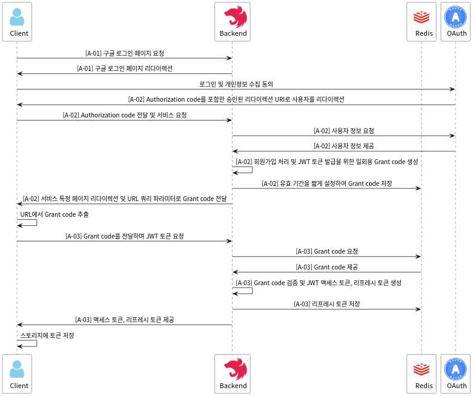

# API Documentation

이 문서는 `Basetalk`의 백엔드 API에 대한 문서이다. 모듈 단위로 API를 구성하였으며, 복잡한 로직에 대해선 시퀀스 다이어그램을 첨부하여 시각적인 이해를 돕는다.

## Auth Module

이 섹션은 인증 관련 모듈의 API에 대한 설명이다.

### Version 1 APIs

|  ID  | Method | URI                                   | Description                                                                                             |
| :--: | :----: | :------------------------------------ | :------------------------------------------------------------------------------------------------------ |
| A-01 |  GET   | /auth/v1/login/oauth2/google          | 사용자를 구글 로그인 페이지로 리다이렉트한다.                                                           |
| A-02 |  GET   | /auth/v1/login/oauth2/google/redirect | 구글 OAuth Provider로부터 사용자 정보를 획득하고 Grant code를 발급하여 리다이렉트한다.                  |
| A-03 |  POST  | /auth/v1/login/oauth2/grant-code      | OAuth 방식으로 로그인 시 리다이렉트된 URI에서 확인할 수 있는 Grant code를 검증하고 JWT 토큰을 생성한다. |

#### [A-01] 구글 로그인 페이지 리다이렉트

- **Request**: URI로 단순 GET 요청을 보낸다.
- **Response**: 구글의 OAuth 로그인 페이지로 리다이렉트한다.
  - **Success status code**: 302

#### [A-02] 구글 OAuth Provider로부터 승인받은 리다이렉트 URI

- **Request**: 구글 OAuth Provider가 클라이언트를 해당 endpoint로 리다이렉션하여 사용자 정보를 전달한다.
- **Response**: 클라이언트에게 응답이 제공된다. 이는 서비스의 실제 endpoint로의 리다이렉션으로 구현된다.
  - **Success status code**: 302
  - **Data format**: URL query parameter
  - **Data detail**: `code=[grant code]`

#### [A-03] OAuth 로그인을 위한 Grant code 검증 및 JWT 토큰 발급

- **Request**: `A-02`에서 전달된 grant code를 전송한다.
  - **Request body**: `{ "code": "[grant code]" }`
- **Response**: JWT 액세스 토큰과 리프레시 토큰이 제공된다.
  - **Success status code**: 200
  - **Data format**: Response body
  - **Data detail**: `{ "accessToken": "[JWT access token]", "refreshToken": "[JWT refresh token]" }`

### Appendix. OAuth Login Process

이 별첨 섹션은 시퀀스 다이어그램을 통해 OAuth를 통한 로그인 과정이 어떻게 이루어지는지에 대한 이해를 시각적으로 돕는다. 전체적인 과정을 묘사해 두었기 때문에 클라이언트의 시각에서 보고자 한다면 클라이언트로부터 나가는 요청과 클라이언트로 들어오는 요청이 어떤 것인지만 확인하면 된다.

