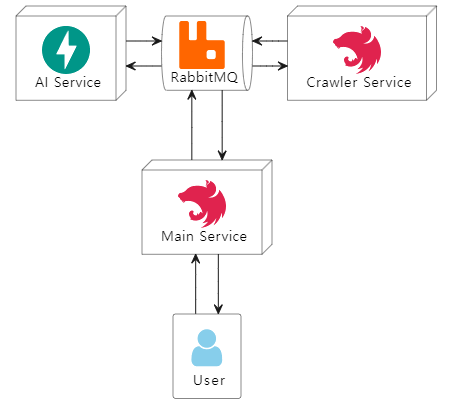

# Microservice Design Documentation

이 문서는 `Basetalk`의 마이크로서비스 간 정의된 이벤트 및 이벤트 핸들링을 시퀀스 다이어그램을 통해 시각화하여 마이크로서비스 간 통신이 어떻게 발생하는지에 대한 이해를 돕는 설계 문서이다.

## Microservices

`Basetalk`에서 정의된 마이크로서비스들은 다음과 같다. 마이크로서비스들은 중간에 `RabbitMQ`를 메시지 브로커로 매개하여 이벤트 기반으로 통신한다.



### Main service

`Basetalk`의 사용자 정보, KBO 경기 정보, 채팅 정보 등을 총체적으로 관리하는 메인 서비스이다. `NestJS`로 구현되어 있으며 `Crawler service`와 `AI service`의 중간에서 두 마이크로서비스와 양방향 통신을 수행한다.

### Crawler service

`Basetalk`의 KBO 경기 정보를 `STATIZ` 플랫폼을 통해 수집하는 크롤링 서비스이다. `NestJS`로 구현되어 있으며 `Main service`와 양방향 통신을 수행한다.

### AI service

`Basetalk`의 비즈니스 로직에 필요한 AI 모델들을 통합하는 서비스이다. `FastAPI`로 구현되어 있으며 `Main service`와 양방향 통신을 수행한다.

## Events

`Basetalk`의 마이크로서비스들 간 정의된 이벤트는 다음과 같다.

| Event ID | Event Name             |     Source      |   Destination   | Description                                                           |
| :------: | :--------------------- | :-------------: | :-------------: | :-------------------------------------------------------------------- |
|   E-01   | Game.Updated           | Crawler service |  Main service   | 업데이트된 경기 정보를 알린다.                                        |
|   E-02   | Game.Calculate.Average |  Main service   | Crawler service | 특정 경기에 대한 각 팀의 평균 타격/투구 통계량 계산을 요청한다.       |
|   E-03   | Game.Predict.Score     | Crawler service |   AI service    | 어웨이/홈 팀의 평균 타격/투구 통계량을 바탕으로 점수 예측을 요청한다. |
|   E-04   | Game.Save.Prediction   |   AI service    |  Main service   | 특정 경기의 어웨이/홈 팀 예측 점수를 DB에 저장할 것을 요청한다.       |

## Events Detail

이 섹션은 정의된 이벤트들의 동작에 대한 이해를 시각적으로 이해하기 위한 것이다. 여러 개의 비즈니스 로직이 같은 이벤트를 사용할 수도 있으나 기본적인 논리는 같다.

### [E-01]: KBO 경기 정보 갱신

크롤링 서비스가 하루에 한 번씩 주기적으로 연간 경기 데이터를 수집한다. 수집한 이후 업데이트된 경기 데이터가 있을 경우 이를 메인 서비스에 `E-01` 이벤트로 전송한다.

![Event1: [E-01]](images/Event1.png)

Data Queue를 통해 전송되는 데이터의 형식은 다음과 같다.

**[E-01] Data format**

```json
{
  "gameCid": "Game's crawling ID",
  "awayTeam": "Away team",
  "homeTeam": "Home team",
  "awayScore(nullable)": "Away team's score",
  "homeScore(nullable)": "Home team's score",
  "gameStatus": "finished/canceled/scheduled",
  "gameDate": "Game's date"
}
```

### [E-02], [E-03], [E-04]: KBO 경기 점수 예측 파이프라인

메인 서비스가 주기적으로 취소되지 않은 경기들 중 점수 예측이 진행되지 않은 경기들의 데이터를 조회하고 경기의 크롤링 ID를 크롤링 서비스에 전송한다. 크롤링 서비스는 어웨이 팀과 홈 팀의 해당 경기 날짜까지의 평균 타격/투구 데이터를 계산하고 이를 AI 서비스에 전송한다. AI 서비스는 평균 통계량을 바탕으로 점수를 예측하고 이를 메인 서비스에 전송한다.

![Event234: [E-02], [E-03], [E-04]](images/Event234.png)

Data Queue를 통해 전송되는 데이터의 형식은 다음과 같다.

**[E-02] Data format**

```json
{
  "gameId": "Game's crawling ID"
}
```

**[E-03] Data format**

```json
{
  "game_id": "Game's crawling ID",
  "away_team": {
    "bat_info": {
      "PA": "bat data",
      "AB": "bat data",
      "R": "bat data",
      "H": "bat data",
      "HR": "bat data",
      "RBI": "bat data",
      "BB": "bat data",
      "HBP": "bat data",
      "SO": "bat data",
      "GO": "bat data",
      "FO": "bat data",
      "NP": "bat data",
      "GDP": "bat data",
      "LOB": "bat data",
      "ABG": "bat data",
      "OPS": "bat data",
      "LI": "bat data",
      "WPA": "bat data",
      "RE24": "bat data"
    },
    "pitch_info": {
      "IP": "pitch data",
      "TBF": "pitch data",
      "H": "pitch data",
      "R": "pitch data",
      "ER": "pitch data",
      "BB": "pitch data",
      "HBP": "pitch data",
      "K": "pitch data",
      "HR": "pitch data",
      "GO": "pitch data",
      "FO": "pitch data",
      "NP": "pitch data",
      "S": "pitch data",
      "IR": "pitch data",
      "IS": "pitch data",
      "GSC": "pitch data",
      "ERA": "pitch data",
      "WHIP": "pitch data",
      "LI": "pitch data",
      "WPA": "pitch data",
      "RE24": "pitch data"
    }
  },
  "home_team": {
    "bat_info": "The same as above",
    "pitch_info": "The same as above"
  }
}
```

**[E-04] Data format**

```json
{
  "game_id": "Game's crawling ID",
  "away_score": "Away team's predicted score",
  "home_score": "Home team's predicted score"
}
```
