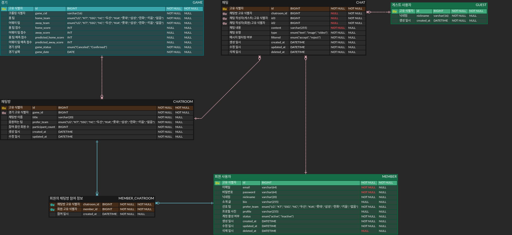

# Relational DBMS Design Documentation

본 문서는 `Basetalk` 서비스의 관계형 데이터베이스 설계 문서이다.

## Required Entities

본 서비스에서 필요한 엔티티들을 정의한다.

- `MEMBER`: 회원 정보
  - `id`(PK): 고유 식별자
  - `email`(unique): 이메일
  - `password`: 비밀번호(hashed)
  - `nickname`: 닉네임
  - `bio`(nullable): 소개 글
  - `prefer_team`: 선호 팀
  - `profile`(nullable): 프로필 사진
  - `status`: 계정의 활성 여부(활성 또는 비활성)
  - `created_at`: 생성 일시
  - `updated_at`: 수정 일시
  - `deleted_at`(nullable): 삭제 일시
- `GAME`: KBO 경기 정보
  - `id`(PK): 고유 식별자
  - `game_cid`: 게임별 할당된 크롤링 식별자
  - `home_team`: 홈 팀
  - `away_team`: 어웨이 팀
  - `home_score`(nullable): 홈 팀 점수
  - `away_score`(nullable): 어웨이 팀 점수
  - `predicted_home_score`(nullable): 홈 팀 예측 점수
  - `predicted_away_score`(nullable): 어웨이 팀 예측 점수
  - `game_status`: 경기 상태(취소, 진행)
  - `game_date`: 경기 날짜
- `CHATROOM`: 채팅방 정보
  - `id`(PK): 고유 식별자
  - `game_id`(FK): 채팅방이 속한 경기의 고유 식별자
  - `member_id`(FK): 채팅방을 생성한 회원의 고유 식별자
  - `title`: 채팅방 이름
  - `prefer_team`: 응원하는 팀
  - `participant_count`: 참여 중인 회원 수
  - `created_at`: 생성 일시
  - `updated_at`: 수정 일시
- `CHAT`: 채팅 메시지 정보
  - `id`(PK): 고유 식별자
  - `chatroom_id`(FK, nullable): 채팅이 속한 채팅방의 고유 식별자
  - `member_id`(FK, nullable): 채팅을 작성한 회원의 고유 식별자
  - `content`: 채팅 내용
  - `type`: 채팅 유형(텍스트, 이미지 또는 비디오 등)
  - `status`: 메시지 상태(승인됨, 필터링됨 또는 삭제됨)
  - `created_at`: 생성 일시
  - `updated_at`: 수정 일시
  - `deleted_at`(nullable): 삭제 일시
- `MEMBER_CHATROOM`: 사용자와 채팅방 간의 관계 정보
  - `id`(PK): 고유 식별자
  - `member_id`(FK): 채팅방에 참여한 사용자의 고유 식별자
  - `chatroom_id`(FK): 사용자가 참여한 채팅방의 고유 식별자
  - `created_at`: 생성 일시(참여 일시)

## Entity Relationship Diagram(ERD)

