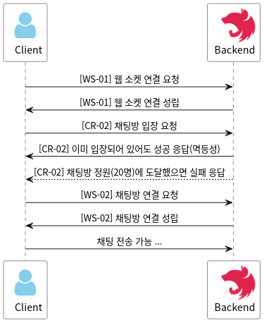

# WebSocket Guide Documentation

이 문서는 `Basetalk`의 채팅 관련 기능에 사용되는 `WebSocket` 통신에 대한 가이드라인을 제공하는 문서이다. 사용자 인증 및 서버 성능과 관련된 문제로 인해 채팅방 입장, 퇴장 등의 기능은 REST API와 통합하였다. 따라서 이에 대한 시각적인 설명을 제공하기 위해 문서를 별도로 분리하였다.

REST API 문서의 채팅방 모듈과 채팅 모듈에 이 문서의 링크를 연결하였기 때문에 읽는 이가 해당 모듈 API들의 작동 방식을 모두 인지하고 있다고 가정하고 설명을 진행한다.

## Defined behavior

`WebSocket` 통신에서 정의된 `WebSocket`의 기능은 대표적으로 다음과 같다.

- **[WS-01] 연결하기**: 액세스 토큰을 사용해 `WebSocket` 연결을 수행한다.
- **[WS-02] 채팅방 연결하기**: `joinRoom` 이벤트를 발생시키면서 채팅방의 ID를 전달하여 채팅방과 실시간으로 연결한다.
- **[WS-03] 채팅방 연결 해제하기**: `leaveRoom` 이벤트를 발생시키면서 채팅방의 ID를 전달하여 채팅방과의 실시간 연결을 해제한다.
- **[WS-04] 채팅 발신/수신하기**: `chat` 이벤트를 발생시키면서 채팅방의 ID와 채팅 내용을 전달하여 채팅을 발신할 수 있다. 또한 이벤트 핸들러를 등록하여 채팅을 수신할 수도 있다.

### [WS-01] Connection

`WebSocket` 연결은 다음과 같이 수행한다.

```js
socket = io("http://localhost:8080/chat", {
  withCredentials: true,
  auth: {
    token: token,
  },
});
```

`io()`의 두 번째 파라미터로 옵션을 전달할 때 `auth.token`에는 액세스 토큰을 전달해야 한다.

### [WS-02] Emit Join Chatroom Event

이 이벤트는 사용자가 이미 참여해 있는 채팅방에 실제로 채팅을 하기 위해 입장할 때 발생시킨다.

```js
socket.emit("joinRoom", chatroomId);
```

이런 식으로 요청을 보낸다. 요청을 보내기 전 [[CR-02] 채팅방 입장](./Rest-API.md#cr-02-채팅방-입장) API를 사용해 채팅방에 입장한 상태여야 한다.

### [WS-03] Emit Leave Chatroom Event

이 이벤트는 사용자가 채팅방 페이지에서 '뒤로가기' 등의 동작으로 나가거나 채팅방 자체를 퇴장하면서 채팅방과의 연결을 해제할 때 발생시킨다.

```js
socket.emit("leaveRoom", chatroomId);
```

이런 식으로 요청을 보낸다. 주의해야 할 점은 이 이벤트를 전송하는 것만으로는 실제로 채팅방에서 퇴장이 되진 않으므로 퇴장 처리를 해야 할 경우엔 [[CR-03] 채팅방 퇴장](./Rest-API.md#cr-03-채팅방-퇴장) API를 사용해야 한다.

### [WS-04] Emit/On Chat Event

이 이벤트는 사용자가 채팅방에서 채팅을 전송할 때 발생시키고, 핸들러를 등록하여 채팅을 수신할 수도 있다.

#### Emit chat event

```js
socket.emit("chat", { chatroomId, content: message });
```

이벤트는 위와 같은 코드로 발생시킬 수 있고, 채팅방 ID와 채팅 내용을 함께 전송해야 한다.

#### Handle chat event

```js
socket.on("chat", (message) => {
  // 아래는 채팅 박스를 추가하는 임의의 코드이다.
  addMessage(`${message.writer.nickname}: ${message.content}`);
});
```

이벤트 핸들러는 위와 같은 코드로 등록할 수 있다. 응답되는 데이터에 많은 정보가 담겨 있기 때문에 응답 데이터 형식도 다시 한번 첨부한다.

```
{
  "id": "[채팅의 ID]",
  "content": "[채팅 내용]",
  "type": "[채팅 유형(텍스트, 이미지 등)]",
  "createdAt": "[채팅 작성 일시]",
  "writer": {
    "id": [작성자의 ID],
    "nickname": "[작성자의 닉네임]",
    "preferTeam": "[작성자의 KBO 선호 팀]",
    "profile": "[작성자의 프로필 사진 경로(nullable)]"
  }
}
```

## Appendix. Event flows

### 채팅방 입장 및 채팅 로직



1. 먼저 서버와 `WebSocket`으로 연결을 수행한다.
2. [[CR-02] 채팅방 입장](Rest-API.md#cr-02-채팅방-입장) API를 사용해 채팅방에 입장한다.
3. [[WS-02] 채팅방 연결하기](#ws-02-emit-join-chatroom-event) 이벤트를 발생시켜 채팅방과의 연결을 수행한다.
4. 위 모든 요청에 성공하면 해당 채팅방에서 채팅을 보낼 수 있는 상태가 된다.
