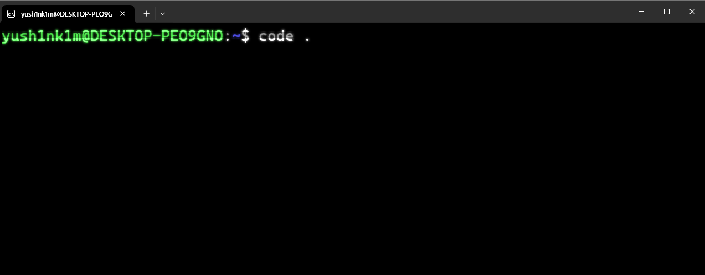
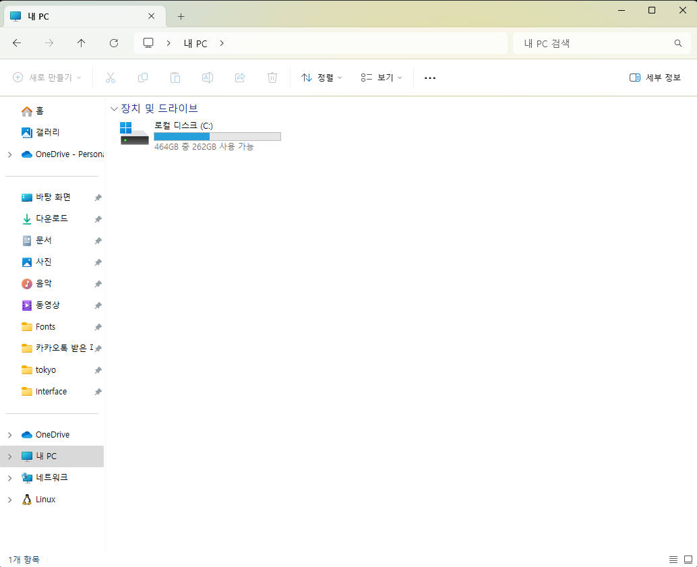
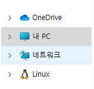
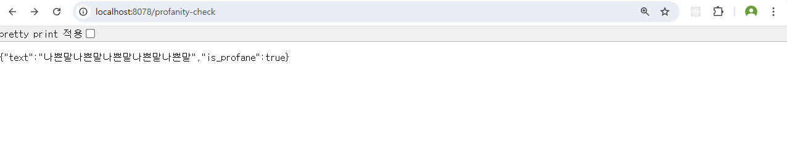

# Basetalk AI API server manual

이 문서는 `Basetalk` 서비스의 백엔드 AI 서비스의 개발 환경 설정에 대한 설명을 제공하고, 파트별로 과제를 할당하기 위해 작성되었다.

## 작업 환경 구성

### WSL

Windows 운영체제를 기준으로 설명을 진행한다. Windows 운영체제에는 WSL(Windows Subsystems for Linux)라고 하는 리눅스 가상환경을 쉽게 구성해주는 기술이 지원된다. [이 링크](https://yongbba.tistory.com/entry/Linux-WSL-%EC%9C%88%EB%8F%84%EC%9A%B0-10%EC%97%90%EC%84%9C-%EB%A6%AC%EB%88%85%EC%8A%A4-%ED%99%98%EA%B2%BD-%EA%B0%84%EB%8B%A8%ED%95%98%EA%B2%8C-%EC%84%A4%EC%B9%98-%ED%95%98%EA%B8%B0)를 통해서 WSL을 설치하고 시작하자. 지금부터는 Windows가 아닌 Linux 계열의 운영체제를 기반으로 설명을 진행한다.



WSL을 실행하면 이렇게 터미널에서 작업을 진행할 수 있는데, 코딩을 여기서 진행하는 건 당연히 무리이다. `vscode`가 이미 설치되어 있다면 사진과 같이 `code .`이라는 명령어로 WSL 상에서 `vscode`를 실행할 수 있다.

### WSL 파일 시스템 접근법


처음 실행하면 이렇게 알 수 없는 파일들로 가득할 것인데, 일단 작업을 위해 아무 디렉터리나 생성해주자. 참고로 디렉터리 구조가 사진과 완벽히 똑같은 상태일 필요는 없다.

사진에서 **dev**라는 디렉터리를 확인할 수 있는데, 이것처럼 임의의 디렉터리를 생성해 주면 된다.



그 다음 Windows에서 **내 PC** 또는 **내 컴퓨터**에 들어가면 왼쪽 바에 `Linux`가 보일 것이다.



이걸 클릭하고, **Ubuntu** - **home** - **WSL 생성 시 지정한 사용자 이름** 순서로 디렉터리를 이동하면 방금 vscode에서 생성한 디렉터리가 보일 것이다. 이렇게 Windows에서 WSL의 파일 시스템에 접근할 수 있다. 만약 개발한 AI 모델을 WSL 상에서 확인해야 한다면 이 경로로 파일을 복사해주면 된다.

### WSL에서의 터미널 명령어

기존에 Windows로 작업을 해왔다면 `cmd`나 `powershell` 같은 터미널을 사용해야 할 순간들이 있었을 것이다. WSL에서의 터미널은 Linux 계열의 명령어를 사용하므로 Windows와는 조금 다르다. 따라서 `pip install ~`와 같은 명령어가 필요하다면 ChatGPT나 구글에 이에 대응되는 명령어가 무엇인지 검색해 보아야 한다.

### Docker 설치

이제 일관적인 작업 환경을 구성하기 위해 `Docker`를 설치할 것이다. 우리가 WSL 설치를 통해 Windows 운영체제 위에서 독립적으로 Linux 운영체제를 사용할 수 있게 된 것과 비슷하게 `Docker` 또한 내 컴퓨터에 설치된 패키지, 환경 설정 등에 크게 구애받지 않고 독립적으로 애플리케이션을 실행할 수 있게 하는 기술이라고 이해하면 된다. 제공하는 `FastAPI` 애플리케이션의 작업 환경을 `Docker`로 구성하였기 때문에 이를 반드시 설치해야 개발을 진행할 수 있다.

```bash
$ sudo apt update
$ sudo apt upgrade
$ sudo apt install docker
$ sudo apt install docker-compose
```

위 명령어들을 순서대로 실행해 주면 된다.

### 서버 실행

이제 `FastAPI` 서버를 실행해줄 것이다. `vscode`에서 `Ctrl` + `J` 단축키로 터미널을 실행할 수 있는데, 터미널을 실행한 후 프로젝트 디렉터리까지 이동해야 한다.


이렇게 디렉터리까지의 경로를 복사해주고, 터미널에서 붙여넣기를 하면 된다. 다음과 같은 명령어로 프로젝트 디렉터리까지 이동한다.

```bash
$ cd "복사한 경로"
```

`cd`는 change directory의 줄임말로, 말 그대로 현재 보고 있는 디렉터리를 변경한다는 말이다. `cd ..` 명령어로는 현재 보고 있는 디렉터리의 상위 디렉터리로 이동이 가능하고, `cd "경로"`를 통해 다른 디렉터리로 이동할 수도 있다.

어쨌든 **src** 디렉터리까지 이동했으면 다음과 같은 명령어로 서버를 실행한다.

```bash
$ sudo docker-compose up --build
```

이제 http://localhost:8078 링크로 이동해 보자.


브라우저에 이렇게 뭔가가 뜨면 서버가 실행에 성공한 것이다. 이제 서버를 실행할 필요가 있을 때마다 위의 명령어만 단 한 번 실행해 주면 되고, 그 이후엔 소스 코드가 변경될 때마다 서버가 자동으로 재시작된다.

### 필요한 패키지 설치

현재 프로젝트의 루트 디렉터리에는 본 문서 **README.md** 외에도 다양한 파일들이 있는데, 그 중 **requirements.txt**라는 파일이 있다. 개발한 모델을 불러와 실행하기 위해서는 추가적인 패키지 설치가 필요할 수 있다. 이때는 이 파일의 내용을 수정하면 된다.

**requirements.txt**

```
fastapi
uvicorn
pika
```

지금은 서버 실행을 위해 `fastapi`, `uvicorn`, `pika`라는 세 개의 패키지가 설치된다. 만약 이 상태에서 `numpy` 패키지가 필요하다면 다음과 같이 수정해주면 된다.

```
fastapi
uvicorn
pika
numpy
```

## 태스크 정의

이 섹션은 비속어 판별 모델, 승패 예측 모델을 코드에 도입하고 테스트하는 방법에 대해 기술한다.

### 공통

서버를 실행하고 http://localhost:8078/profanity-check 경로로 이동하면 비속어 판별 로직을 실행할 수 있고, http://localhost:8078/game-prediction 경로로 이동하면 승패 예측 로직을 실행할 수 있다.



비속어 판별 로직의 경우 처음 실행했을 때 이러한 결과가 표시되면 된다.


승패 예측 로직의 경우 처음 실행했을 때 이러한 결과가 표시되면 된다.

현재는 해당 로직이 실행될 때 가짜 데이터를 넣어 모델을 실행시키도록 구성해놨다. 가짜 데이터를 수정하는 방법도 공유할 것이다. 모델 개발 및 테스트는 친숙한 개발 환경에서 마친 후 서버에서는 단순히 모델을 불러와 예측하고 응답을 생성하는 과정만 구현할 것을 권장한다.

### 비속어 판별 로직

**src/routers/mock.py**

```python
from fastapi import APIRouter
from src.models.game_data import GamePredictionRequest, TeamData, BatInfo, PitchInfo
from src.models.text_data import ProfanityCheckRequest
from src.services.profanity_service import detect_profanity
from src.services.game_service import predict_outcome

router = APIRouter()

@router.get("/profanity-check")
async def mock_profanity_check():
    # 가짜 데이터를 사용하여 비속어 판별 함수 호출
    mock_text = "나쁜말나쁜말나쁜말나쁜말나쁜말"

    mock_data = ProfanityCheckRequest(content=mock_text)

    # 모델을 실행하고 결과를 받아온다.
    result = detect_profanity(mock_data)

    return {
        "text": mock_text,
        "is_profane": result,
    }

...
```

`mock_text`의 값을 바꾸어 비속어 판별 대상이 되는 텍스트를 변경할 수 있다.

**src/services/profanity_service.py**

```python
from src.models.text_data import ProfanityCheckRequest

# 비속어 판별 함수
# 비속어를 판별하고 true or false를 return한다.
def detect_profanity(data: ProfanityCheckRequest) -> bool:
    # 데이터 확인을 위한 로그
    print(f"전체 데이터: {data}")

    print(f"비속어 판별의 대상이 되는 텍스트 데이터: {data.content}")

    is_profane = True

    # TODO: AI 모델을 불러와 필요한 작업을 수행하고 결과값을 반환한다.

    return is_profane
```

AI 모델을 불러와 비속어 판별을 수행하는 로직을 여기에 구현하면 된다. `data.content`에 판별 대상이 되는 텍스트가 담기므로 이를 단순히 모델에 넣고 돌리면 된다.

### 승패 예측 로직

**src/routers/mock.py**

```python
...

@router.get("/game-prediction")
async def mock_game_prediction():
    # 가짜 데이터를 사용하여 승패 예측 함수 호출
    mock_bat_info = BatInfo(
        PA=5, AB=4, R=1, H=2, HR=1, RBI=2, BB=1, HBP=0, SO=1, GO=1, FO=2,
        NP=20, GDP=0, LOB=3, ABG=0.5, OPS=1.0, LI=0.9, WPA=0.1, RE24=0.5
    )

    mock_pitch_info = PitchInfo(
        IP=5.0, TBF=20, H=3, R=1, ER=1, BB=2, HBP=0, K=5, HR=0, GO=3, FO=4,
        NP=80, S=60, IR=0, IS=0, GSC=60, ERA=2.0, WHIP=1.2, LI=0.9, WPA=0.2, RE24=0.5
    )

    mock_away_team = TeamData(bat_info=mock_bat_info, pitch_info=mock_pitch_info)
    mock_home_team = TeamData(bat_info=mock_bat_info, pitch_info=mock_pitch_info)

    mock_data = GamePredictionRequest(away_team=mock_away_team, home_team=mock_home_team)

    result = predict_outcome(mock_data)

    return result
```

단순한 가짜 데이터이므로 실제 데이터처럼 어웨이 팀과 홈 팀의 데이터를 구분하지 않았다. 즉, 지금은 어웨이 팀과 홈 팀이 같은 타격 데이터와 투구 데이터를 공유한다. `mock_bat_info`를 `mock_home_bat_info`, `mock_away_bat_info`처럼 구분하여 가짜 데이터를 생성할 수 있다.

**src/services/game_service.py**

```python
from src.models.game_data import GamePredictionRequest

# 승패 예측 함수
# 주어진 팀 데이터를 바탕으로 양 팀의 점수를 예측하고 반환한다.
def predict_outcome(data: GamePredictionRequest):
    # 데이터 확인을 위한 로그
    print(f"전체 데이터: {data}")

    print(f"어웨이 팀 데이터: {data.away_team}")
    print(f"홈 팀 데이터: {data.home_team}")

    print(f"어웨이 팀 타격 데이터: {data.away_team.bat_info}")
    print(f"어웨이 팀 투구 데이터: {data.away_team.pitch_info}")

    print(f"홈 팀 타격 데이터: {data.home_team.bat_info}")
    print(f"홈 팀 투구 데이터: {data.home_team.pitch_info}")

    # 결과 데이터: 모델을 실행하고 아래 이름의 변수를 반환
    away_score = 1
    home_score = 2

    # TODO: AI 모델을 불러와 필요한 작업을 수행하고 결과값을 반환한다.

    return {
        "away_score": away_score,
        "home_score": home_score,
    }
```

AI 모델을 불러와 승패 예측을 수행하는 로직을 여기에 구현하면 된다. 로그를 찍어둔 것처럼 `data.away_team.bat_info`와 같은 문법으로 어웨이 팀의 타격 데이터를 추출할 수 있다. 데이터가 매우 복잡하기 때문에 **src.models.game_data.py**를 참고하는 것을 권장한다.

## 정리

백엔드에서는 흔히 외부로부터 요청을 받는 부분(라우터 또는 컨트롤러 계층)과 핵심 로직을 수행하는 부분(서비스 계층)을 분리한다. 현재 설명한 코드들에서는 **services**라는 이름의 디렉터리 안에 존재하는 코드들이 핵심 로직을 수행하는 부분이고, **routers**라는 이름의 디렉터리 안에 존재하는 코드들이 외부로부터 요청을 받는 부분이다.

AI 개발자들이 모델을 연결하여 서비스 로직을 명세사항에 따라 잘 구성하면 백엔드 개발자는 이를 토대로 어떤 유형의 요청이든 형식만 잘 준수하여 들어온다면 일관된 방식으로 인공지능 모델을 실행하고 결과값을 전달할 수 있다.

---
